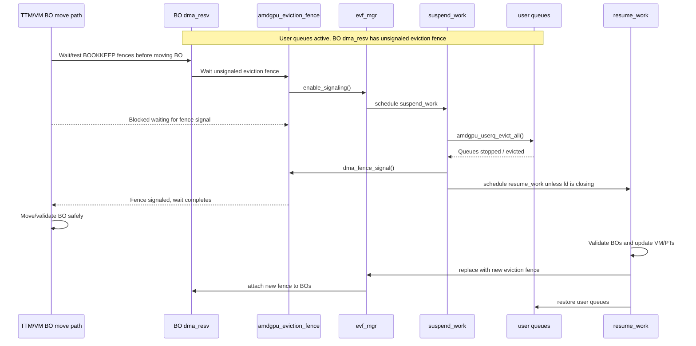
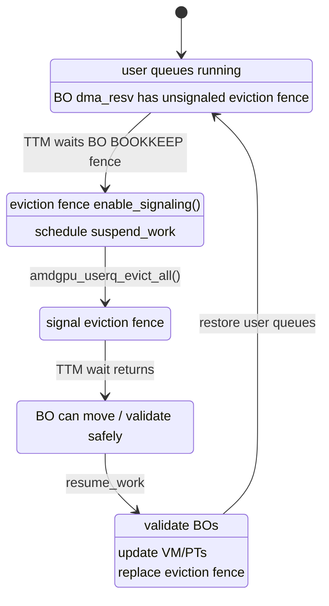

## Question

`amdgpu_gem_object_open()` 中调用的 `amdgpu_eviction_fence_attach(&fpriv->evf_mgr, abo)` 是什么含义？`evf_mgr` 如何用 eviction fence 在 BO 移动和 amdgpu usermode queue eviction 之间建立同步？

## Answer

`evf_mgr` 是 per `amdgpu_fpriv` 的 eviction fence manager，也就是 per DRM fd / client 的 user queue eviction/grace-period 控制器。它维护当前 fd 的 `amdgpu_eviction_fence`，以及当这个 fence 被等待时需要调度的 `suspend_work`。`amdgpu_gem_object_open()` 在 GEM handle 被加入某个 `drm_file` 时，把当前 `evf_mgr->ev_fence` 作为 `DMA_RESV_USAGE_BOOKKEEP` fence 挂到 BO 的 `dma_resv` 上，让 TTM/VM 后续在移动、释放或等待该 BO idle 时能先碰到这个 fence。

这个 fence 表示的不是某个 GPU job 已完成，而是“该 fd 的 user queues 已经被 evict/suspend，不会继续运行在旧的 BO/VM 状态上”。核心问题是 user queue 可以在 userspace-owned queue ring 中写入 BO GPU VA 等引用，常规提交不再经过 kernel，kernel 不能像处理 CPU `mmap` PTE 那样在 BO move 前枚举这些引用，也不现实去扫描 queue packet。eviction fence 因而不是追踪每一次 BO 使用，而是给 user queues 建立一个 move 前必须经过的 quiescent point，有点像 RCU grace period：等待方触发 eviction，queues 停下后 fence signal，BO move/VM validate 才继续。

因此它把 BO 移动和 user queue eviction 连接成一种懒触发同步：TTM/VM 想移动 BO 时会等待 BO `dma_resv` 上的 `BOOKKEEP` fence；等待 eviction fence 会调用 fence ops 的 `enable_signaling()`；`enable_signaling()` 调度 `evf_mgr->suspend_work`；worker 调用 `amdgpu_userq_evict()` evict user queues；evict 完成后 signal eviction fence；BO move path 的等待解除，才可以继续移动或 validate BO。

恢复路径会在重新启动 user queues 前调用 `amdgpu_eviction_fence_replace_fence()`。该函数在当前 fence 已 signal 或不存在时创建新 fence，把 `evf_mgr->ev_fence` 更新为新 fence，并把新 fence attach 到当前 `drm_exec` 已锁住的 BO 集合。随后 user queues 被 restore。这样下一次内存管理再要移动这些 BO，就会遇到新一轮未 signal eviction fence，并再次触发 queue eviction。

`DMA_RESV_USAGE_BOOKKEEP` 是这里的关键选择。它不会作为普通 userspace implicit read/write sync 参与同步，但会被 TTM/内存管理等待 BO idle、释放、迁移等路径看到。也就是说，eviction fence 不应该让普通提交无谓地等待；它只应该保护内存管理级别的 BO residency、mapping 和移动操作。

时序图如下：

状态机视角如下：

## Trace

1. `amdgpu_fpriv` embeds `struct amdgpu_eviction_fence_mgr evf_mgr`, so the manager is per open file/client rather than per device or per BO.
2. `amdgpu_eviction_fence_init()` initializes one fence context, a sequence counter, a lock, and `suspend_work` for that fd. The comment says this is done once per open.
3. `amdgpu_userq_ensure_ev_fence()` ensures active user queues have a valid, unsignaled eviction fence. If there is no current fence or it is already signaled, it schedules `resume_work` and retries until a valid fence exists.
4. `amdgpu_gem_object_open()` runs during GEM handle creation/import for a `drm_file`. After it creates or references the BO's per-VM `bo_va`, it calls `amdgpu_eviction_fence_attach(&fpriv->evf_mgr, abo)`.
5. `amdgpu_eviction_fence_attach()` assumes the BO reservation is already locked by the caller. It reserves one `dma_resv` fence slot, reads `evf_mgr->ev_fence` under `ev_fence_lock`, and, if present, adds it to `bo->tbo.base.resv` as `DMA_RESV_USAGE_BOOKKEEP`.
6. TTM's BO wait/release paths use `DMA_RESV_USAGE_BOOKKEEP` when deciding whether a BO is idle or before delayed deletion/memory cleanup. That makes eviction fences visible to memory management operations without making them normal read/write implicit sync fences.
7. When a waiter or callback needs the eviction fence to become signalable, dma-fence core calls `amdgpu_eviction_fence_enable_signaling()`. That method schedules `evf_mgr->suspend_work` and returns true.
8. `amdgpu_eviction_fence_suspend_worker()` recovers `fpriv` from `evf_mgr`, obtains the current eviction fence reference, and calls `amdgpu_userq_evict(uq_mgr, ev_fence)` under `userq_mutex`.
9. `amdgpu_userq_evict()` waits for pending userq fence work, evicts all user queues, signals the eviction fence, and then schedules `resume_work` unless the fd is closing.
10. `amdgpu_userq_restore_worker()` flushes pending suspend work, locks the userq manager, calls `amdgpu_userq_vm_validate()`, and then restores all queues.
11. `amdgpu_userq_vm_validate()` validates page-table BOs and evicted BOs, waits for VM update fences to complete, then calls `amdgpu_eviction_fence_replace_fence(&fpriv->evf_mgr, &exec)` before returning to the restore path.
12. `amdgpu_eviction_fence_replace_fence()` creates a new eviction fence only if the current one is missing or already signaled. It updates `evf_mgr->ev_fence`, attaches the new fence to each object locked in the supplied `drm_exec`, and drops the old fence reference.
13. `amdgpu_eviction_fence_detach()` removes this fd's eviction-fence dependency from a BO by replacing fences with the same `ev_fence_ctx` by a signaled stub fence. `amdgpu_gem_object_close()` calls it for non always-valid BOs during handle close.

## Evidence

- `drivers/gpu/drm/amd/amdgpu/amdgpu.h:442-453`: `amdgpu_fpriv` contains the per-client VM, user queue manager, and `evf_mgr`.
- `drivers/gpu/drm/amd/amdgpu/amdgpu_eviction_fence.h:28-42`: `amdgpu_eviction_fence` wraps `dma_fence`; `amdgpu_eviction_fence_mgr` stores `ev_fence_ctx`, `ev_fence_seq`, `ev_fence_lock`, current `ev_fence`, `suspend_work`, and `fd_closing`.
- `drivers/gpu/drm/amd/amdgpu/amdgpu_kms.c:1519-1527`: open-file initialization sets up `userq_mgr` and then initializes `fpriv->evf_mgr`.
- `drivers/gpu/drm/amd/amdgpu/amdgpu_drv.c:2971-2985`: DRM file release sets `fd_closing`, destroys the eviction fence, and finalizes the userq manager before delegating to `drm_release()`.
- `drivers/gpu/drm/amd/amdgpu/amdgpu_gem.c:226-273`: `amdgpu_gem_object_open()` checks userptr/always-valid constraints, locks BO and VM PD with `drm_exec`, creates or refs `bo_va`, then attaches the file's eviction fence to the BO.
- `drivers/gpu/drm/amd/amdgpu/amdgpu_gem.c:326-365`: `amdgpu_gem_object_close()` detaches the eviction fence for non always-valid BOs, decrements the `bo_va` refcount, removes BO VA state when it reaches zero, and clears freed mappings.
- `drivers/gpu/drm/amd/amdgpu/amdgpu_eviction_fence.c:130-149`: eviction fence `enable_signaling()` schedules `evf_mgr->suspend_work`.
- `drivers/gpu/drm/amd/amdgpu/amdgpu_eviction_fence.c:151-174`: eviction fence creation stores the manager pointer, names the timeline after `current`, initializes a software `dma_fence`, and uses the manager's fence context and sequence.
- `drivers/gpu/drm/amd/amdgpu/amdgpu_eviction_fence.c:177-195`: eviction fence destroy flushes pending suspend work, waits for the current fence, and drops the manager's fence reference.
- `drivers/gpu/drm/amd/amdgpu/amdgpu_eviction_fence.c:197-220`: `amdgpu_eviction_fence_attach()` reserves a fence slot and adds the current eviction fence to the BO `dma_resv` as `DMA_RESV_USAGE_BOOKKEEP`.
- `drivers/gpu/drm/amd/amdgpu/amdgpu_eviction_fence.c:222-230`: `amdgpu_eviction_fence_detach()` replaces fences from the manager's fence context with a signaled stub.
- `drivers/gpu/drm/amd/amdgpu/amdgpu_eviction_fence.c:46-100`: `amdgpu_eviction_fence_replace_fence()` creates a new fence when needed, publishes it in the manager, attaches it to all locked exec objects, and releases the old fence.
- `drivers/gpu/drm/amd/amdgpu/amdgpu_eviction_fence.c:102-128`: `suspend_work` obtains the current eviction fence and calls `amdgpu_userq_evict()` under the userq mutex.
- `drivers/gpu/drm/amd/amdgpu/amdgpu_userq.c:471-494`: `amdgpu_userq_ensure_ev_fence()` loops until the fd has a current unsignaled eviction fence.
- `drivers/gpu/drm/amd/amdgpu/amdgpu_userq.c:788-796`: user queue creation ensures a valid eviction fence before proceeding.
- `drivers/gpu/drm/amd/amdgpu/amdgpu_userq_fence.c:566-574`: userq fence creation also ensures an active eviction fence before creating a new user queue fence.
- `drivers/gpu/drm/amd/amdgpu/amdgpu_userq.c:1130-1258`: userq VM validation locks VM/BO state, validates evicted BOs, updates VM page tables, waits for VM update fences, and replaces the eviction fence before returning.
- `drivers/gpu/drm/amd/amdgpu/amdgpu_userq.c:1271-1294`: restore worker flushes pending suspend work, validates the VM, then restores queues.
- `drivers/gpu/drm/amd/amdgpu/amdgpu_userq.c:1369-1397`: userq eviction waits pending userq fence work, evicts all queues, signals the eviction fence, and schedules resume work unless the fd is closing.
- `include/linux/dma-resv.h:60-116`: `DMA_RESV_USAGE_BOOKKEEP` is documented as no implicit sync and is intended for bookkeeping operations such as preemption fences, page table updates, and explicitly synchronized submissions.
- `drivers/dma-buf/dma-fence.c:618-658`: dma-fence core calls `ops->enable_signaling()` when software signaling is requested.
- `drivers/dma-buf/dma-fence.c:682-709`: adding a fence callback also enables signaling if needed, which can trigger the eviction fence's suspend work.
- `drivers/gpu/drm/ttm/ttm_bo.c:218-248`: TTM delayed deletion flushes and waits all `DMA_RESV_USAGE_BOOKKEEP` fences before memory cleanup.
- `drivers/gpu/drm/ttm/ttm_bo.c:1072-1091`: `ttm_bo_wait_ctx()` tests or waits `DMA_RESV_USAGE_BOOKKEEP` fences when waiting for a BO to become idle.
- [[wiki/inspections/linux-amdgpu-userq-bo-mmap-vs-eviction-manager]]: contrasts this userq quiescent-point mechanism with the ordinary CPU mmap path, where BO moves can zap PTEs and force userspace back through the fault handler.
- [[wiki/inspections/linux-dma-resv-shared-buffer-sync]]: related background on why `dma_resv` exists as a per-buffer fence container and how usage classes encode synchronization scope.

## Uncertainty

The high-level synchronization model is clear from the inspected paths. This note did not trace every TTM BO move entry point that can wait `BOOKKEEP` fences; it uses representative TTM wait/release paths plus the documented `dma_resv` usage semantics to explain why the eviction fence becomes visible to memory management operations.

There are potential implementation risks in nearby error paths, such as `amdgpu_gem_object_open()` not checking `amdgpu_vm_bo_add()` returning `NULL`, and returning errors after attaching/refcounting state without a full rollback. Those risks are adjacent to the eviction-fence mechanism but are not the main subject of this page.

## Related Pages

- [[wiki/inspections/linux-amdgpu-userq-bo-mmap-vs-eviction-manager]]
- [[wiki/inspections/linux-dma-resv-shared-buffer-sync]]
- [[wiki/index]]
